# Automaton — руководство игрока

В этой игре нет конвейеров, буров, манипуляторов, логистических роботов и прибрежного насоса.
Их работу делают **автоматоны** — машины, которые выполняют ваши программы на TypeScript.
Завод строится не из лент, а из маршрутов и алгоритмов: «доедь до руды, накопай, отвези в печь».

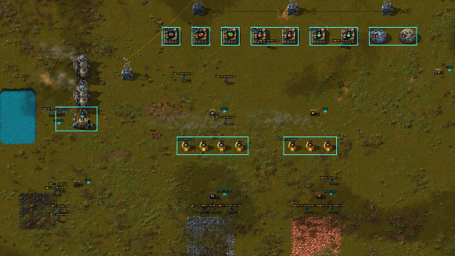

Справочники: [API.md](API.md) — все функции машин, [LANGUAGE.md](LANGUAGE.md) — язык и его отличия
от JavaScript, [VSCODE.md](VSCODE.md) — программы в VS Code.

- [Первые 15 минут](#первые-15-минут)
- [Машина и её окно](#машина-и-её-окно)
- [Программы](#программы)
- [Свои библиотеки](#свои-библиотеки)
- [Язык за пять минут](#язык-за-пять-минут)
- [Как машина думает](#как-машина-думает)
- [Мир: метки, зоны, зрение](#мир-метки-зоны-зрение)
- [Рецепты](#рецепты)
- [Прогрессия](#прогрессия)
- [Разбор: фабрика науки](#разбор-фабрика-науки)
- [Игра по сети](#игра-по-сети)
- [Отладка и частые ошибки](#отладка-и-частые-ошибки)

## Первые 15 минут

В начале freeplay у вас два **рабочих автоматона Mk1** и четыре **метки** — вместо бура и печи.
Библиотека команды пустая: программы пишете вы. **Справка** по всем функциям с примерами — прямо в игре:
F1 или «?» на панели быстрого доступа (поиск по имени, «Первые шаги», «Частые ошибки»).

1. **Склад.** Поставьте деревянный сундук. Рядом поставьте метку — откроется окно имени, назовите
   её `склад`.
2. **Первая программа.** Поставьте автоматон у угольного месторождения и кликните по нему. В окне
   машины нажмите «Программы…» → «Новая», назовите программу `Шахтёр`, вставьте код и нажмите
   «Опубликовать»:

   ```ts
   // Шахтёр: копает руду у месторождения и возит в сундук у метки «склад».
   const { ore } = me.args<{ ore?: Item }>()
   const item: Item = ore ?? "coal"
   const field = scan.resources().find((p) => p.item === item)!.nearest
   while (true) {
     move(field)
     mine(item)
     // Угольщик подкладывает уголь и себе в топливо.
     if (item === "coal" && me.fuel < 0.5) refuel("coal")
     move(marker("склад"), { radius: 2 })
     put(scan.entities({ type: "container" })[0], item)
   }
   ```

   Внизу окна — «Назначить машине», затем в окне машины — «Запустить». Машина накопает угля,
   отвезёт его в сундук у метки «склад» и вернётся.
3. **Шахтёр на железе.** Вторая машина — у железной руды: та же программа (кнопка с именем программы
   в окне машины), а в поле «Параметры» впишите `{"ore": "iron-ore"}`. Одна программа, разные
   настройки у разных машин. Топливо ей — уголь в окно машины.
4. **Плавильня.** Скрафтите несколько каменных печей и поставьте их рядом. Ярлыком «Программатор»
   на панели быстрого доступа выделите их рамкой и назовите зону `плавильня`. Поставьте второй
   сундук и метку `плиты`. Третьей машине напишите печника: взять руду и уголь со склада, разложить
   по печам зоны (`find("stone-furnace", zone("плавильня"))`), забрать плиты и отвезти к метке `плиты`.
5. **Новые машины** крафтятся из железа и шестерён — рецепт открыт сразу.

Готовые примеры посложнее — в папке [examples](../examples): печник, водовоз, перевозчик по маршрутам,
кладовщик, оркестратор с рабочими, патруль. Многие подключают библиотеку
[examples/helpers.ts](../examples/helpers.ts) — опубликуйте её под именем `lib/Помощники`.

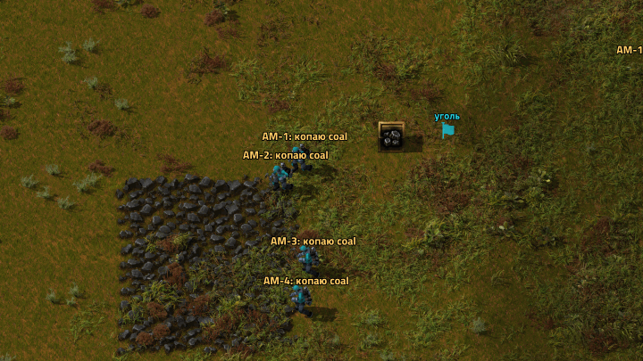

Дальше — электричество. Прибрежного насоса нет: **воду к котлам возят машины**. Скрафтите котёл —
откроется исследование «Жидкости для автоматонов». Поставьте у котлов резервуар (в котёл влезает
всего 200 воды), метку `котельная` и напишите водовоза: `pump` у озера, `drain` в резервуар (пример —
[examples/water.ts](../examples/water.ts)). Один водовоз — примерно на один котёл.

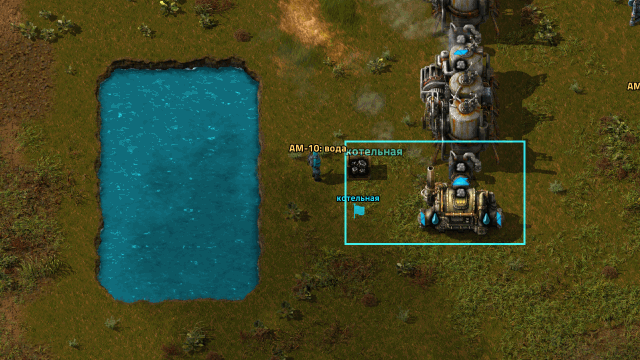

## Машина и её окно

Клик по машине открывает её окно:

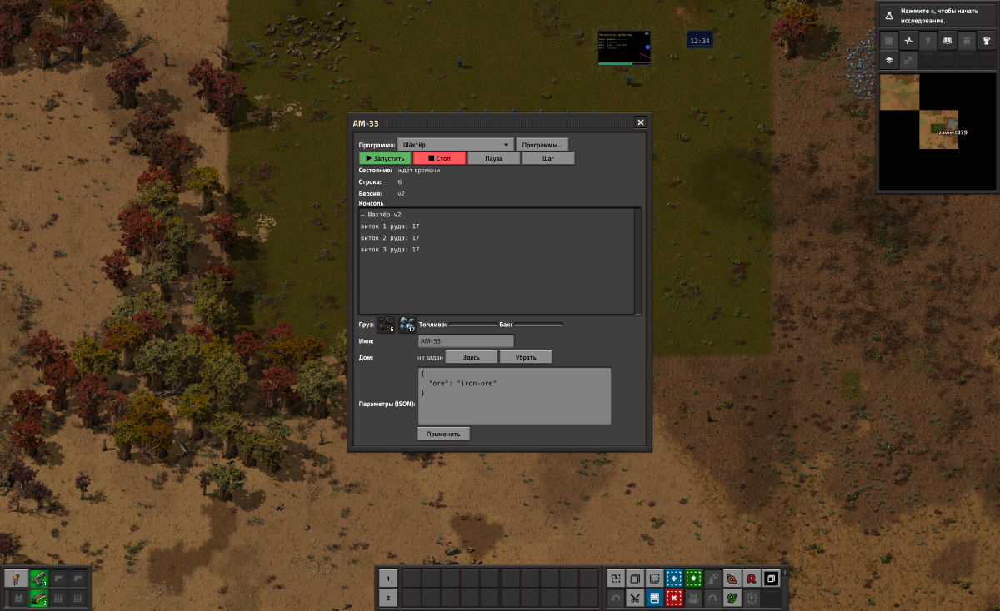


- **Программа** — кнопка с её именем открывает **окно выбора**: поиск, папки, сколько машин уже
  работает по каждой программе, недавние наверху. «Запустить», «Стоп», «Пауза», «Шаг».

  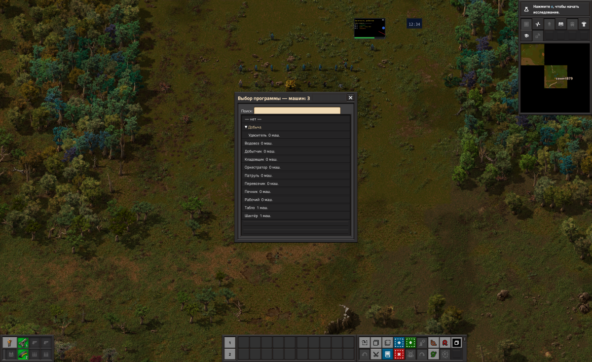

- **Параметры** — JSON, который программа читает через `me.args()`.
- **Консоль** — последние 100 строк `print` и сообщения об ошибках; текущая строка программы.
- **Груз, топливо, бак** — что машина везёт и сколько у неё энергии.
- **Имя и дом** — имя видно над машиной (Alt), «дом» — точка для `goHome()`.

Подобранная машина помнит имя, номер, энергию и бак, а её программа и параметры ждут, пока
машину поставят снова. Погибшая машина высыпает груз на землю.

**Все машины** — ярлык на панели быстрого доступа (или «Машины: N» у программы в окне программ):
таблица машин команды — программа, состояние, топливо; сортировка по столбцу, поиск, фильтры «с ошибкой»,
«без топлива», «стоят» и по программе. Клик по машине — удалённый вид на неё и её окно.

**Чертежи** запоминают машины: программу и параметры. Выделите рамкой участок с машинами (или Ctrl+C) —
по чертежу встанут такие же машины с теми же программами и сразу начнут работать (имена — новые). В рамке
должно быть хоть одно здание (сундук, столб): из одних машин игра чертёж не создаёт. Если
программы с таким именем у команды нет (чертёж из другой игры), машина встанет без программы — пришлите
программы строкой обмена.

Настроить сразу много машин:

- **Копировать настройки** — Shift+ПКМ по машине (те же клавиши, что у зданий) запоминает её программу
  и параметры, Shift+ЛКМ по другой машине — вставляет и запускает.
- **«Программатор» правой кнопкой** — рамка по машинам открывает окно выбора: программа запустится
  на всех машинах в рамке. Рамка правой кнопкой с Shift — остановить их. (Левой кнопкой «Программатор»
  по-прежнему выделяет зоны.)

Над машиной — значок проблемы: кончилось топливо, нет пути, полный груз, ошибка программы.
Ошибка программы и застрявшая машина поднимают оповещение у миникарты.

## Программы

Программы общие для всей команды. «Программы…» в окне машины открывает **редактор** на весь
экран: номера строк, ошибки подсвечиваются при публикации, клик по ошибке выделяет строку.
Неопубликованный текст хранится как черновик.

- **Публикация** компилирует программу: с ошибкой она не публикуется — ошибка видна в редакторе.
- **Новая версия** перезапускает все машины, которые её выполняют (память `me.memory` сохраняется).
- У программы хранятся последние 10 версий; старую можно открыть и опубликовать снова.
- Программа, которая раз за разом упирается в лимиты (память, бесконечная рекурсия), уходит
  в **карантин** и останавливается на всех машинах; снимает карантин новая версия.

Игра проверяет и **типы**: `me.cargo.cout("coal")` — «у типа Inventory нет свойства cout»,
`wait("5")` — «тип "5" не подходит туда, где нужен number». Проверка мягкая: ошибка только там,
где она несомненна.

Программа открывается **в цвете** (просмотр). Чтобы поправить, нажмите «Править» или кликните по
строке: откроется поле ввода с курсором на ней. После публикации — снова просмотр; ошибки видны
в своих строках: красная «●» у номера, ошибочное место красным, текст ошибки — в конце строки.
«Проверить» (и переход в «Просмотр») ищет ошибки, не публикуя: машины с программой продолжают работать.

Программы можно раскладывать **по папкам**: имя `Логистика/Перевозчик` кладёт программу в папку
«Логистика». В списке слева — дерево (клик по папке сворачивает её) и поиск по имени.

Писать в редакторе игры можно, но удобнее в **VS Code** — подсказки, документация при наведении,
ошибки до публикации; сохранили файл — программа опубликована. Как настроить — [VSCODE.md](VSCODE.md).

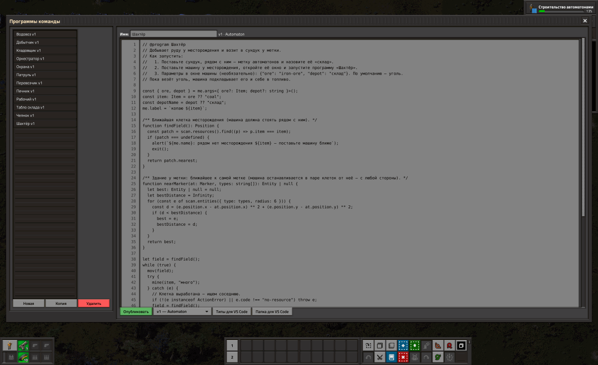

## Свои библиотеки

Программа может **импортировать** другие программы команды — как модули в TypeScript. Общие функции
пишутся один раз в библиотеке, остальные программы её подключают. Пример — библиотека `lib/Помощники`
([examples/helpers.ts](../examples/helpers.ts)): на ней построены примеры шахтёра, печника, добытчика
и перевозчика:

```ts
import { attempt, chestAt, nearestField } from "./lib/Помощники";

// Копать железную руду рядом и складывать в сундук у метки «руда».
const field = nearestField("iron-ore");
while (true) {
  move(field);
  attempt(() => mine("iron-ore", 20));
  const chest = chestAt("руда");
  attempt(() => put(chest, "copper-ore"), "сундук");
}
```

Своя библиотека — обычная программа, где перед функциями, константами, классами и типами стоит `export`:

```ts
// Программа «lib/Склад»
export const DEPOTS = { coal: "уголь", iron: "железо" };

export function stock(chest: Entity, item: Item): number {
  return chest.count(item);
}
```

- **Путь** — от папки программы: из `Добыча/Шахтёр` библиотека `lib/Склад` — это `"../lib/Склад"`,
  из программы в корне — `"./lib/Склад"`. В VS Code это те же пути между файлами.
- **Библиотека** — программа, где только объявления и есть `export`. В списке она помечена, на машине
  её не запустить. Видно, кто её импортирует; пока импортируют — её нельзя удалить.
- **Изменили библиотеку** — все программы, которые её импортируют, пересобираются, их машины
  перезапускаются. Если какая-то с новой версией не собирается (например, исчезла нужная функция), она
  продолжает работать на прежней сборке, а в списке у неё «⚠» с текстом ошибки.
- **Переименовали или перенесли** библиотеку в другую папку — пути импорта в программах поправятся сами.
- Ошибка внутри библиотеки показывается с её именем: `lib/Склад:12: Error: …`.

## Поделиться программами

Программы переносятся **строкой**, как чертежи: товарищу в другую команду, в другое сохранение, на форум.

- **Экспорт** (нижний ряд окна программ): отметьте программы или папки — модули, без которых они
  не соберутся, отметятся сами. Строка `am1:…` внизу окна уже выделена: Ctrl+C.
- **Импорт**: вставьте строку — окно покажет, что в ней: новые программы, те же (пропустятся) и те, что
  у команды есть с другим текстом. Для них выберите: **заменить** (новая версия, прежняя — в истории версий),
  **рядом** (как «Шахтёр (2)») или **пропустить**. «Импортировать» публикует — права те же, что у публикации.

Подробно (что можно импортировать, `import * as`, `export default`) — [LANGUAGE.md](LANGUAGE.md), «Модули».

## Язык за пять минут

Программа — обычный TypeScript, только без `async`/`await`: действия машины просто ждут конца.

```ts
// Переменные и типы
const ore: Item = "iron-ore"
let trips = 0

// Функции, стрелочные функции, замыкания
const lowOn = (item: Item, below: number) => (e: Entity) => e.count(item) < below

// Объекты, массивы, деструктуризация, ?. и ??
const { depot = "склад" } = me.args<{ depot?: string }>()
const hungry = scan.entities({ type: "furnace" }).filter(lowOn("coal", 5))
const first = hungry[0]?.position ?? me.position

// Классы и интерфейсы
interface Job { ready(): boolean; run(): void }
class Feed implements Job {
  constructor(readonly furnace: Entity) {}
  ready(): boolean { return this.furnace.count("coal") < 5 }
  run(): void { move(this.furnace); put(this.furnace, "coal", 5) }
}

// Ошибки действий — ActionError с кодом
try {
  mine(ore, 50)
} catch (e) {
  if (e instanceof ActionError && e.code === "no-resource") say("руда кончилась")
  else throw e
}

// Коллекции
const seen = new Set<number>()
const counts = new Map<Item, number>()
for (const stack of me.cargo.items()) counts.set(stack.name, stack.count)
```

Чего нет (и что писать вместо): `var` → `let`/`const`, `async`/`await` → не нужно, регулярные
выражения → методы строк, `enum` → объединение строк (`type Dir = "north" | "south"`), `==` → `===`.
`null` и `undefined` — одно и то же. Подробно — [LANGUAGE.md](LANGUAGE.md).

## Как машина думает

- **Действия ждут.** `move`, `mine`, `put`, `take`, `pump`, `wait`… возвращают управление, когда
  дело сделано. Пока машина едет, её программа стоит и не тратит ресурсы.
- **Квант.** Каждый тик машина исполняет до 50 инструкций (Mk2 — 100, Mk3 — 200, больше —
  исследованием «Процессор»). Длинный цикл без действий просто растянется на несколько тиков —
  игру он не затормозит. Подробно — ниже, «Время: квант, ожидание, долг».
- **Руки и глаза — рядом.** Со зданием машина работает в радиусе `me.reach` (10 клеток, как
  персонаж), видит в радиусе `me.vision` (10 клеток, больше — «Сенсоры» и модели постарше).
  Далёкое здание видно только как «есть такое» — его состояние надо узнать, подъехав, или спросить
  у машины, которая рядом.
- **Энергия.** Mk1 жжёт топливо из топливного слота (`refuel` перекладывает его из груза), Mk2+
  заряжают аккумулятор на зарядной станции (`charge`).
- **Память.** Переменные живут, пока работает программа; `me.memory` переживает перезапуск
  и подбор машины.

### Время: квант, ожидание, долг

Строки программы выполняются не все в один тик. Правила такие:

1. **Виток цикла стоит 1 инструкцию** кванта, вызов «долгой» функции (с циклом или действием) — тоже 1.
   Обычные выражения и короткие функции — бесплатно. Кончился квант — пауза до следующего тика.
2. **Ожидание квант не тратит.** Пока машина едет, копает или ждёт (`wait`, `receive`), её программа
   стоит и ничего не стоит.
3. **Тяжёлый вызов — сразу, а потом отдых.** `publish` тысяче подписчиков, `sort` большого массива,
   `map` по большому массиву выполняются целиком в этом тике, а перерасход машина отрабатывает
   следующими тиками (пропускает их). Цены — в [API.md, «Время программы»](API.md#время-программы).

Пример на Mk1: посмотреть уголь в сундуке → сообщить 120 подписчикам → разослать задание
100 помощникам циклом → взять уголь. Письма подписчикам уходят в первом тике, потом два тика
машина «отдыхает», ещё два тика идёт цикл — и только на пятом тике она берёт уголь. Это меньше десятой
доли секунды, но **мир за это время меняется**: другая машина могла забрать уголь.

Отсюда практические советы:

- **Проверяйте результат действия, а не предполагайте.** `take` возвращает, сколько реально взято;
  если брать нечего — `ActionError("not-enough-items")`. В библиотеке «Помощники» для этого есть `attempt`.
- **Не оптимизируйте под квант.** Длинный цикл просто дольше идёт; программа от этого не ломается.
- **Ждите через `wait` и действия**, а не пустым циклом: ожидание бесплатно, пустой цикл тратит квант.
- **Много машин считают одновременно** — у всех вместе есть общий бюджет на тик (настройка карты).
  Если его не хватает, часть машин получит ход тиком позже: машины думают медленнее, игра не тормозит.

Ошибки действий — `ActionError` с кодом:

| Код | Что случилось |
|---|---|
| `no-path` / `stuck` | Пути нет / машину зажали |
| `out-of-reach` | Здание дальше 10 клеток — сначала `move` |
| `out-of-sight` | Состояние здания не видно — подъехать |
| `invalid-target` | Цели нет или она не подходит |
| `no-fuel` | Кончилась энергия |
| `cargo-full` / `target-full` | Груз полон / в здание не влезает |
| `not-enough-items` | В грузе нет нужного |
| `no-resource` | Рядом нечего добывать |
| `not-researched` | Функция откроется исследованием |
| `timeout` | Истёк таймаут (`request`, `move` с `timeout`) |

## Мир: метки, зоны, зрение

- **Метка** — флажок с именем, через который можно пройти. `marker("склад")` — его позиция.
  Переименовать — `/am-name`, наведя курсор.
- **Зона** — прямоугольник, выделенный «Программатором» (рамка левой кнопкой). `zone("плавильня")`, а
  `find("stone-furnace", zone("плавильня"))` — печи в ней на любом расстоянии.
- **Зрение** — `scan.entities(...)`, `scan.resources()`, `scan.robots()`, `scan.items()`,
  `scan.water()` и (с «Сенсорами 2») `scan.enemies()`: только в радиусе зрения, от ближнего к дальнему.
- **Карта** — `map.tag(позиция, текст, значок)` ставит отметку на карте для всех игроков.

## Рецепты

**Шахтёр с запасом топлива**

```ts
const field = scan.resources().find((p) => p.item === "coal")!.nearest
while (true) {
  move(field)
  mine("coal")
  if (me.fuel < 0.5) refuel("coal")
  move(marker("склад"), { radius: 2 })
  put(scan.entities({ type: "container" })[0], "coal")
}
```

**Кормить все печи в зоне**

```ts
for (const furnace of find({ type: "furnace" }, zone("плавильня"))) {
  move(furnace)
  if (furnace.count("coal") < 5) put(furnace, "coal", 5)
  put(furnace, "iron-ore", 10)
}
```

**Спросить у машины, которая видит склад** (нужна «Радиосвязь»)

```ts
const coal = request<number>("кладовщик", "сколько", "coal", 10)
print(`на складе ${coal} угля`)
```

**Разделить работу без ссор** — захват на доске

```ts
for (const furnace of find({ type: "furnace" }, zone("плавильня"))) {
  if (!board.claim(`печь-${furnace.id}`, 30)) continue  // эту печь уже кормит другая машина
  move(furnace)
  put(furnace, "iron-ore", 20)
  board.release(`печь-${furnace.id}`)
}
```

**Очередь заданий**

```ts
// Диспетчер
tasks.push("доставка", { item: "iron-plate", to: "сборка" }, { priority: 5 })

// Рабочий: задание не закончено за 60 с — вернётся в очередь
const task = tasks.next<{ item: Item; to: string }>("доставка")!
move(marker(task.data.to))
task.done()
```

**Табло**

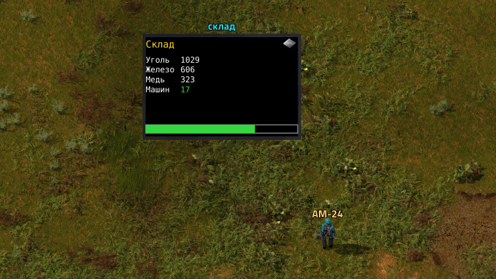

```ts
const screen = display("штаб")
screen.frame(() => {
  screen.clear("black")
  screen.text(4, 4, `Угля: ${board.get<number>("уголь") ?? 0}`, { color: "yellow", size: 12 })
  screen.bar(4, 24, screen.width - 8, 6, me.fuel, "green")
})
```

Целые программы — в папке [examples](../examples) и в [API.md](API.md): оркестратор с рабочими и табло,
разведчик, патруль.

## Прогрессия

| Исследование | Что даёт |
|---|---|
| Радиосвязь автоматонов (место «Логистики») | сообщения, `robot()`, доска, очереди задач |
| Табло | малое и большое табло, `display()` |
| Наладка | `setRecipe` — машины сами меняют рецепт сборщика |
| Жидкости для автоматонов (скрафтить котёл) | бак, `pump`, `fill`, `drain` |
| Строительство автоматонами | `build`, `deconstruct`, `rotate` |
| Автоматоны и цепи | сигнальная метка, `signals` |
| Сенсоры 1–3 | зрение 16 / 24 / 32 клетки, `scan.enemies` |
| Автоматон Mk2, Mk3 | электрические модели, зарядная станция |
| Боевые автоматоны 1–2 | пулемёт и ракетомёт, `attack`, `guard`, `patrol`, `reload` |
| Летающие автоматоны 1–2 | перевозчики, которые летят по прямой над всем |
| Скорость, груз, добыча, процессор, память, баки 1–3 | улучшения всех машин |

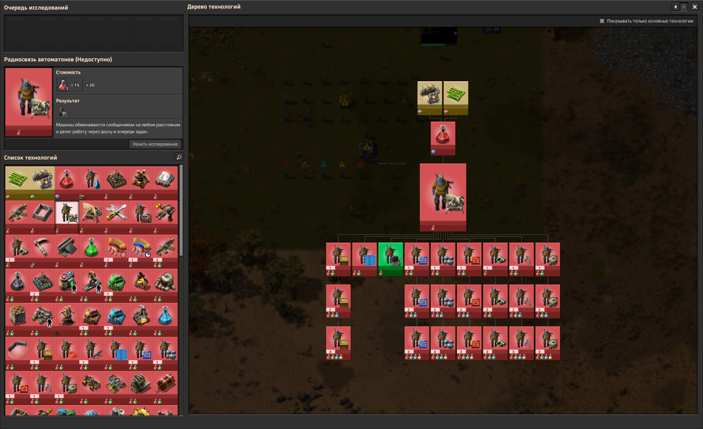

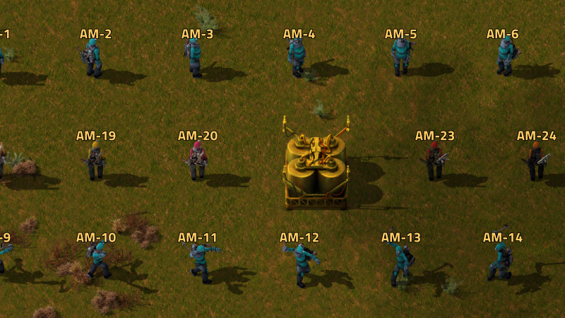

| Модель | Скорость | Груз | Бак | Энергия | Особое |
|---|---|---|---|---|---|
| Рабочий Mk1 | 6 клеток/с | 10 | 1000 | топливо | — |
| Рабочий Mk2 | 8.4 | 20 | 2000 | аккумулятор 10 МДж | — |
| Рабочий Mk3 | 10.8 | 30 | 4000 | аккумулятор 25 МДж | — |
| Боевой Mk1 | 7.2 | 5 | — | топливо | пулемёт, 350 здоровья |
| Боевой Mk2 | 7.8 | 5 | — | аккумулятор | ракетомёт, 700 здоровья |
| Летающий Mk1 | 15 | 2 | — | аккумулятор 5 МДж | не добывает |
| Летающий Mk2 | 24 | 4 | — | аккумулятор 10 МДж | не добывает |

Боевые машины отбиваются сами — бой ведёт движок, программа только решает, где стоять или куда ехать:

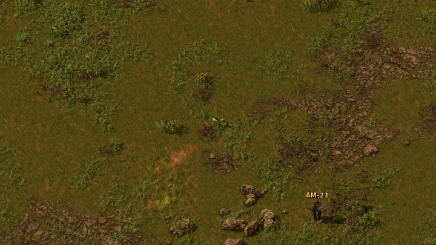

Летающие перевозчики летят по прямой над всем — для дальних маршрутов и больших масштабов:

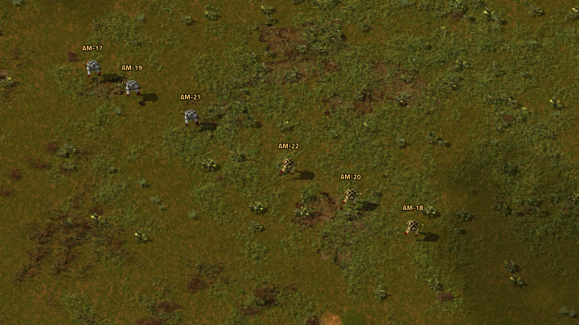

## Разбор: фабрика науки

Сохранение `automaton-science` (или `/am-science` на своей карте) — фабрика красной и зелёной науки
целиком на машинах. Она собрана из трёх программ-примеров с разными параметрами — «Добытчик»,
«Перевозчик» и «Водовоз» из [examples](../examples) (`/am-science` публикует их команде), — так же можно
собрать любую цепочку.

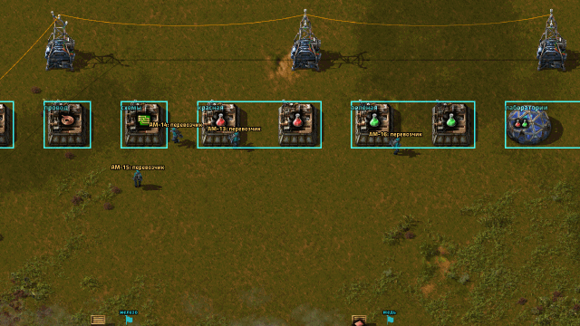

**Склады** — деревянные сундуки, рядом с каждым метка: `уголь`, `железная руда`, `медная руда`,
`железо`, `медь`, `наука`. **Зоны** («Программатором») — группы зданий: `печи-железо`, `печи-медь`,
`котельная`, `шестерни`, `провод`, `схемы`, `красная`, `зелёная`, `лаборатории`.

**Добытчики** (9 машин) копают и везут руду на склад, топливо берут на складе угля:

```json
{"ore": "iron-ore", "depot": "железная руда"}
```

**Водовоз** набирает воду у озера и заливает в котёл; уголь котлу и себе берёт из сундука у котельной.

**Перевозчики** (6 машин) возят по маршрутам «откуда → куда». Маршрут берёт предмет из сундука у метки
или из зданий зоны и раскладывает в здания зоны (каждому — до `keep` штук) или в сундук. Например,
перевозчик плавильни:

```json
{"routes": [
  {"item": "iron-ore",   "from": {"marker": "железная руда"}, "to": {"zone": "печи-железо"}, "keep": 20, "batch": 80},
  {"item": "coal",       "from": {"marker": "уголь"},         "to": {"zone": "печи-железо"}, "keep": 5,  "batch": 20},
  {"item": "iron-plate", "from": {"zone": "печи-железо"},     "to": {"marker": "железо"}}
]}
```

и перевозчик сборки:

```json
{"routes": [
  {"item": "iron-plate",         "from": {"marker": "железо"},  "to": {"zone": "схемы"},   "keep": 20, "batch": 40},
  {"item": "copper-cable",       "from": {"zone": "провод"},    "to": {"zone": "схемы"},   "keep": 30},
  {"item": "electronic-circuit", "from": {"zone": "схемы"},     "to": {"zone": "зелёная"}, "keep": 10},
  {"item": "iron-plate",         "from": {"marker": "железо"},  "to": {"zone": "зелёная"}, "keep": 10, "batch": 20}
]}
```

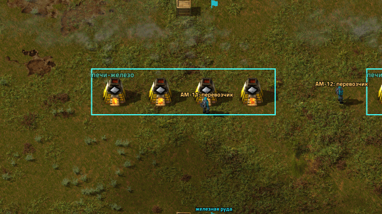

Что подсмотреть, строя свою:

- **Уголь — первым.** Без угля стоит всё: печи, котёл, машины. Шахтёров угля нужно больше, чем кажется,
  и стартовый запас на складе.
- **keep у сундука.** Маршрут в сундук без `keep` выгружает всё, что машина везёт; с `keep` — только до
  этого количества (иначе, например, уголь утечёт в сундук у котельной).
- **Узкое место видно в окне машины.** Перевозчик всё время ждёт у пустого склада — не хватает добытчиков;
  стоит у полных печей — печам нужен уголь.
- **Больше машин — больше маршрутов параллельно.** Один перевозчик на 3–4 маршрута; длинную цепочку
  делите между несколькими.

## Игра по сети

- Программы, метки, зоны, табло, доска и задачи — общие для команды.
- Кто может публиковать — настройка карты «Кто может публиковать программы» (все или админы).
- Машины исполняются одинаково у всех игроков; зашедший посреди игры получает всё как есть.
- Нагрузка: 300 машин с программами добавляют около 0.6 мс к тику (в тике 16.7 мс).

## Отладка и частые ошибки

- **Консоль машины** — в её окне; из чата: `/am-log <номер> [строк]`.
- **Пауза и шаг** в окне машины: «Шаг» выполняет одну инструкцию, видна текущая строка.
- `/am-info <номер>` — состояние машины, `/am-look` — здание под курсором глазами машины,
  `/am-run <номер> <программа>`, `/am-stop <номер>`, `/am-args <номер> {…}`, `/am-home <номер>`.

| Видите | Причина |
|---|---|
| `out-of-reach` у `put`/`take` | забыли `move` к зданию |
| `out-of-sight` при чтении `furnace.count(…)` | здание далеко — подъехать или спросить по радио |
| `no-path` | цель за водой или стеной; `canReach(...)` проверит заранее |
| машина стоит со значком топлива | `refuel` из груза (Mk1) или `charge()` у станции (Mk2+) |
| `not-researched` | нужное исследование ещё не изучено |
| программа «в карантине» | исправьте бесконечную рекурсию или рост памяти и опубликуйте снова |
